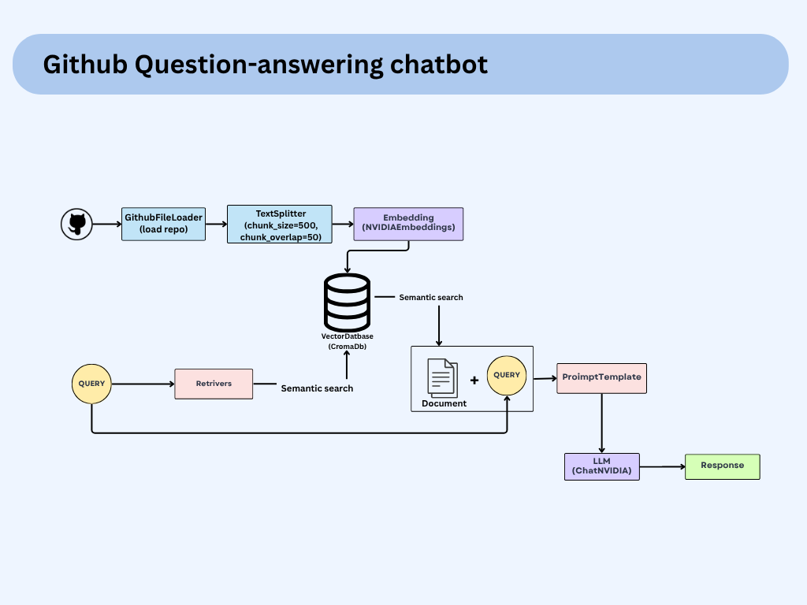

# GitHub QA Assistant

This project implements a Question-Answering system for GitHub repositories using semantic search and large language models.



## 🧠 Overview

The GitHub QA Assistant allows users to ask questions about a GitHub repository’s code and documentation using natural language. It uses semantic search with NVIDIA embeddings and an LLM to understand and respond intelligently.

## ✅ Features

- Natural language querying on repository contents
- Code explanation and understanding
- Smart documentation search and retrieval
- Semantic search with ChromaDB
- Prompt templating and LLM-powered answers (ChatNVIDIA)

## 🚀 Setup

1. Clone the repository:
   ```bash
   git clone https://github.com/yourusername/github-qa-assistant.git
   cd github-qa-assistant
   ```

2. Install dependencies:
   ```bash
   pip install -r requirements.txt
   ```

3. Configure your `.env` with GitHub API token and any necessary credentials.

4. Run the application:
   ```bash
   python main.py --repo "username/repository" --query "your question"
   ```

## 📦 Requirements

- Python 3.8+
- GitHub API access token
- NVIDIA AI Embeddings
- ChromaDB
- FastMCP
- LangChain packages

## 📄 License

This project is licensed under the MIT License.

## 🤝 Contributing

We welcome contributions! Please read `CONTRIBUTING.md` for details.
